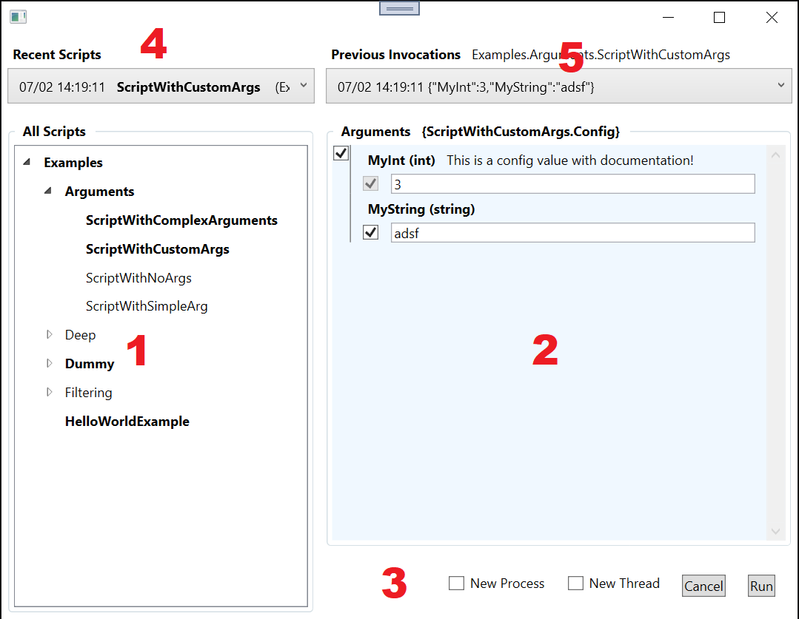

# Rapid.NET
*A framework for scripting and rapid-prototyping in .NET.*

The goal of Rapid.NET.Net is to make C# (and other .NET languages) more accessible for rapid-prototyping and scripting for more people around the world. Up until now, in order to make even the simplest C# applications, people typically create a whole new project that essentially just acts as an entry-point to their class libraries. This is cumbersome, leads to bloated solutions, and generally deters scripting behavior that would otherwise be highly advantageous.

Rapid.NET.Net allows you to create a single one-line project that acts as an "entry-point" to your whole ever-growing library of scripts. It adds productivity features that make it easy to launch and manage your scripts as well, including:

- Supports complex user-defined script arguments
- Includes a WPF UI to select and launch scripts
- Tracks history of script execution


## Quick Start

To start creating and launching scripts with Rapid.NET.Net using the WPF UI, do the following:

- Install the NuGet packages to your .NET Framework project:

  - TODO
  
- In the `Main` method of your project, write:

  ```c#
  using Rapid.NET;
  using Rapid.NET.Wpf;
  ...
      
  [STAThread]
  static void Main(string[] args) 
  {
      LaunchMethods.RunFromArgs(args);
  }
  ```

- Create a class, add a constructor with 0 or 1 arguments, and annotate it with the `[Script]` attribute.

- Run your project:

  -  If no command-line arguments are specified, it will launch the WPF UI (see below for details).
    `>Examples.exe`
  - If a single argument is supplied, it should be the full-name of the script you want to execute. `>Examples.exe Examples.MySimpleScript`
  - If your script's constructor takes an argument, then the second command-line argument should be a JSON-serialized argument for the constructor.
    `>Examples.exe Examples.MyScriptWithArgs "{ \"MyString\": \"Hello\"}"` 
  - TODO: Specify JSON text file.


## How it works

Rapid.NET.Net use `System.Reflection` to inspect your project(s) for classes you've written that have the `[Script]` attribute applied. Optional JSON-serialized arguments (input either via command line or the WPF UI) are then fed to a special static method defined in your script class called `Run()`, thereby invoking whatever code you've placed in there. Note: The Run() method can have either 0 or 1 input arguments.

For example, consider a console application called Examples.exe with the following `Main` method and script class definition:

```C#
namespace Examples 
{
    class Program 
    {        
        [STAThread]
        static void Main(string[] args) 
        {
            LaunchMethods.RunFromArgs(args);
        }
    }
    
	[Script]
    public class MySimpleScript 
    {
        public static void Run() 
        {
            Console.WriteLine("This is a super simple script!");
            Console.WriteLine("Press ENTER to exit.");
            Console.ReadLine();
        }
    }
}
```

The `MySimpleScript.Run()` method can be invoked like so:

```
>Examples.exe Examples.MySimpleScript

This is a super simple script!
Press ENTER to exit.
```

You can also define a script that accepts arguments by defining your `Run` method to accept a single argument like so:

```c#
[Script]
public class MyScriptWithArgs
{
    public class Config
    {
        public int MyInt = 3;
        public string MyString = "adsf";
    }

    public static void Run(Config cfg)
    {
        Console.WriteLine("Script was run with argument: " cfg);
        Console.WriteLine("Press ENTER to exit.");
        Console.ReadLine();
    }
}
```

After adding this to your project, you can now execute it as follows:

```[C#]
>Examples.exe Examples.MyScriptWithArgs "{  \"MyInt\": 5,  \"MyString\": \"Hello World\"}"

Script was run with argument: MyInt = 5 | MyString = Hello World
Press ENTER to exit.
```


## WPF UI

Practically speaking, the WPF UI is what makes the Rapid.NET.Net package so useful. See the image below for reference:

1. Lists all 'Scripts' in your project, hierarchically by namespace. 
   1. Note that recently-executed scripts will appear in **bold** font.
2. Contains a form where you can specify the input arguments to your script.
   1. If an item is 'unchecked', `null` will be supplied.
3. Allows you to execute the script with the supplied arguments.
   1. `New Process` will launch a new instance of the current project and run it with command line arguments that correspond to the arguments supplied in the form. 
   2. `New Thread` creates a new thread and runs the script on it.
4. Contains an ordered list of the most-recently executed scripts.
5. When a script is selected from the left pane, contains a history of executions of the specified script.
   1. Selecting an item from this list will populate the arguments form to match that prior execution.




## Script Execution History

Each time a script is executed via the UI, a record of it is saved to a special text file (by default located in `[Desktop]\Rapid.NET\[ProjectName]\ScriptHistory.json`) fully-specifying the arguments supplied and time of execution. This is used to populate the 'recent scripts' information in the WPF UI.

Each time a script is executed via the UI, the window location and size is also saved to the same folder in a file called `WindowConfig.json`. 

Either or both of these files can be deleted anytime.

NOTE: The folder location for the history .json files can be updated by adding a `RapidHistoryDir` key to your project's App.config file:

```xml
<configuration>
	<appSettings>
    	<add key="RapidHistoryDir" value="C:\MyFolder"/>
	</appSettings>
</configuration>
```


## Attribute Filtering

If you want to launch a UI with only a subset of your script library, you can do so by creating a custom attribute class, annotating the desired script classes with it, and then specifying the attribute as a filter when launching the program, e.g. :

```C#
public class MyFilteringAttribute : Attribute {}

[Script, MyFiltering]
public class MySimpleScript { ... }
```


```
> Examples.exe [Examples.MyFilteringAttribute]
```

